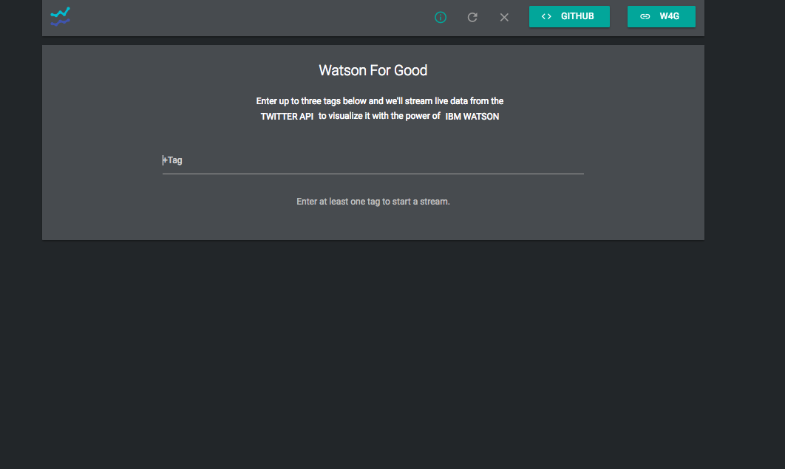

# User Manual
## Basic User Manual
* Our app is designed to be as simple as possible for our most basic user. We want the interface to be intuitive and obvious. Text on screen provides the necessary visual prompts to make users input hashtags. 
* Once one hashtag is entered, the text saying to input at least one hashtag is replaced by a button that once clicks starts the live stream. 
	* The replacement with the stream button is a further visual cue that indicates to the user how the app should be operated.
* After that, all the user has to do is watch as charts and sentiment analysis is automatically generated and dynamically updated.

